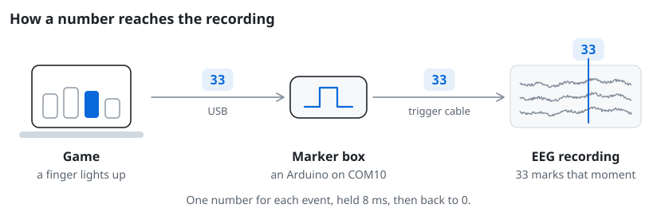
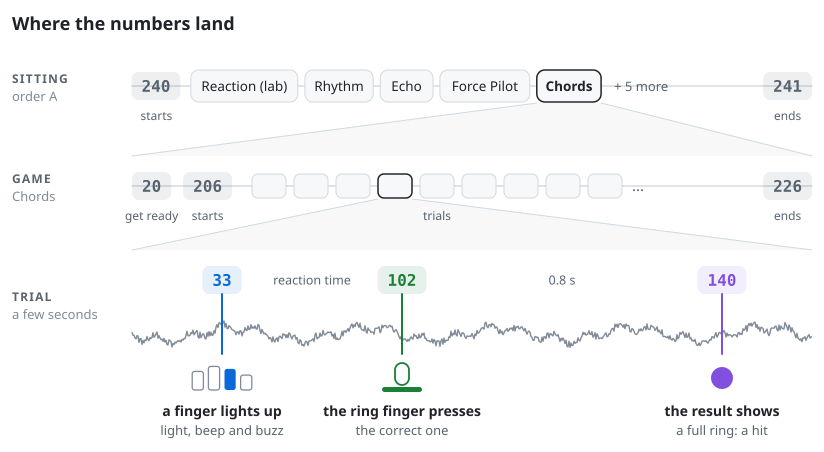
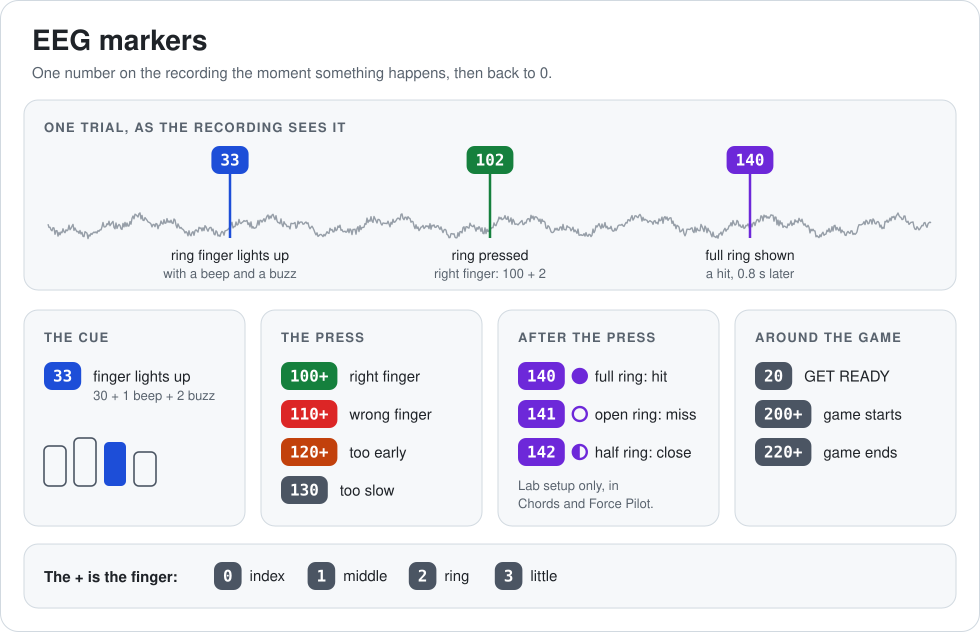

<h1 align="center">EEG lab folder</h1>

Finger Rehab for the EEG lab: the game, its marker settings and a PsychoPy launcher. Copy it to the lab PC without <code>developer/</code>, or use <code>FingerRehab-EEGLab.zip</code> from the release, which leaves it out.

## Run it

1. Plug the trigger box in first. On a new lab PC, measure its sound delays once: Settings, Setup, Audio delay.
2. Open `run_in_psychopy.py` in PsychoPy Coder and press **Run**. ActiView's trigger byte goes 255 to 0 when the port opens. If a port list shows instead, pick the EEG marker's port (COM10), then **Continue**.
3. Log in. The menu shows the recording's name, for example `P07_2026-09-24.bdf`. Start ActiView under that name, saved in `sessions/eeg`.
4. On the hub, pick **Lab session**, then **Start**. It runs the lab sitting in the code's order: the lab's Reaction task in place of both Reaction blocks, and no Muscle Memory. Reaction opens on its setup screen: pick the timing group, then **START**.
5. Take the whole `sessions` folder home. The games and `eeg/` go together.

## Markers

While ActiView records, the game writes a number onto the recording the moment something happens, so the brain signal can be cut around each event afterwards.

<picture><source media="(prefers-color-scheme: dark)" srcset="../app/docs/images/eeg_markers_how_dark.svg"></picture>

<picture><source media="(prefers-color-scheme: dark)" srcset="../app/docs/images/eeg_markers_where_dark.svg"></picture>

<picture><source media="(prefers-color-scheme: dark)" srcset="../app/docs/images/eeg_cheat_sheet_dark.svg"></picture>

Every session also saves `markers_codes.csv`: the full map it was recorded under, with the codes other sittings send.

Timing, for the analysis

A stimulus byte goes out straight after the frame that draws the stimulus; the monitor's own delay in lighting the picture was not measured (no light sensor), so visual epochs carry a fixed offset per monitor. A press byte (100 and up) goes out when the finger's smoothed force first passes its trigger, 30% of the way from resting to the light press at calibration. It leaves 0 to one frame (17 ms) after that 200 Hz sample, and `raw.csv` keeps both times, so response-locked epochs move back to the sample (`t_event`). That sample is timed when it reaches the computer, in USB bursts about 20 ms apart, so it can itself be up to 20 ms late.

## In this folder

| | |
| --- | --- |
| `run_in_psychopy.py` | Starts the game: the exe on Windows, `source/` anywhere else |
| `Finger Rehab.exe` | The game, from the latest [release](https://github.com/basil2fxs/Hand-Rehab-Thesis/releases/latest) |
| `eeg_lab.yaml` | Lab settings: COM10, 9600 baud, 8 ms pulses |
| `source/` | The game's code, for PsychoPy's own Python |
| `sessions/` | Everything recorded here |
| `developer/` | For setting up, not for the lab: an EEG simulator for rehearsing, the PsychoPy download and a new-PC check ([README](developer/README.md)) |

`eeg_lab.yaml` and `source/` are copies of the app, never edited here: `python3 app/scripts/check_lab_sync.py --fix` rebuilds them. Full checklist: [eeg_lab_setup.txt](../app/docs/eeg_lab_setup.txt).
