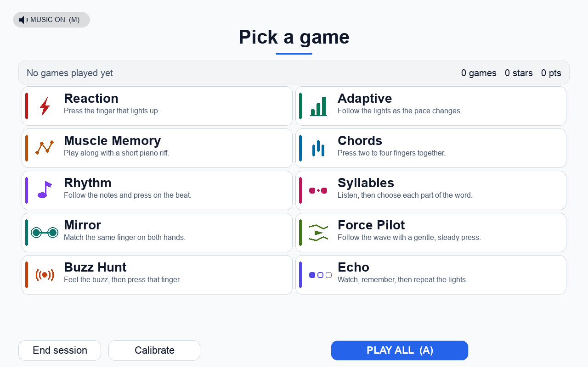
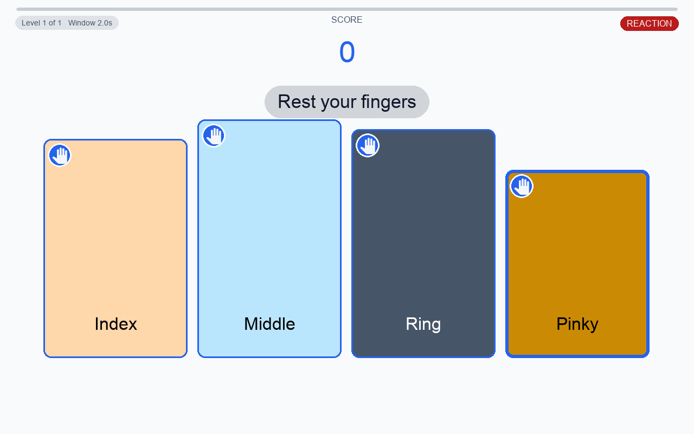
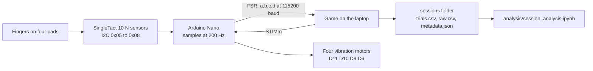

# Finger Rehab

Ten finger games using four SingleTact force pads and four vibration motors per hand.
Arduino Nano boards stream the force over USB. The notebook turns each game recording into thesis figures.




## How it works



**The sensors.** Each finger rests on a SingleTact CS8-10N pad, 10 N full scale, read over I2C at 0x05
index, 0x06 middle, 0x07 ring, 0x08 pinky and sent at 200 Hz as `FSR: a,b,c,d`. A failed read is sent as
0, so a dead pad and a loose plug look the same. The nominal scale is 0.019531 N per count above the
resting baseline. Check it with known loads before quoting force accuracy.

**The buzzers.** Four vibration motors, one per finger, on pins D11 D10 D9 D6. The laptop sends `STIM:n`
for lane 1 to 4 and the board pulses that motor. At boot every board buzzes all four in turn as a self
test, about 1.6 s of buzzing. That is normal.

**The game loop.** A press is found in the force stream, not by a switch. Each sensor keeps a slow
baseline that absorbs drift without following a press, and a press crosses the gap between that person's
resting level and their light press. Logging in measures that gap once per hand, about a minute. A mode
then cues a finger, waits, scores it and repeats.

**What gets logged.** Every block writes one row per trial, every raw force sample, the calibration and
settings it ran under, and a small HTML report. Nothing is overwritten.
**Where sessions land.** Beside the app, or in the repo when run from source, under
`sessions/<date>/<person>_<time>_<mode>/`. If that folder cannot be written the app falls back to
`~/Finger Rehab Data`, and Settings has an Open data folder button for whichever is in use.

## Run it

```
pip install -r requirements.txt
python main.py
```

Nothing plugged in? It falls back to the keyboard: `J K L ;` right hand, `F D S A` left, index to little.
Force Pilot and Buzz Hunt need the device; the other eight play on the keyboard.

Windows: run `builds\Windows\Finger Rehab.exe`, or build it with `builds\build_app.bat`. macOS:
`builds/build_app.sh`. The EEG lab gets one folder, `docs/lab_package`: the exe, `eeg_lab.yaml`,
`run_in_psychopy.py` and a `source/` copy. Notes in [docs/eeg_lab_setup.txt](docs/eeg_lab_setup.txt).

## The ten games

| Game | What the patient does, and what it measures |
| --- | --- |
| **Reaction** | Press the finger that lights up. Measures how fast the hand answers the eye. |
| **Adaptive** | The same, with the pace following the player. Measures speed at a held difficulty. |
| **Muscle Memory** | Play a piano riff, take after take. Measures learning of a repeated sequence. |
| **Chords** | Press two to four fingers at once. Measures moving fingers together and holding the rest still. |
| **Rhythm** | Press on the beat of a song. Measures timing error against the beat. |
| **Syllables** | Catch the right part of a spoken word. Records which written syllable was chosen. |
| **Mirror** | Press the same finger on both hands at once. Measures how well the hands stay together. |
| **Force Pilot** | Hold a press inside a moving corridor. Measures steady control of force. |
| **Buzz Hunt** | Feel which finger buzzed, then press it. Measures the sense of touch. |
| **Echo** | Watch a sequence light up, then repeat it back. Records the longest completed sequence in this game. |

## Troubleshooting

Settings (the login cog) has live readings, ports, Test STIM, Flash firmware, Sensor address and Open data folder.
Calibrate sits beside it.

**A sensor reads nothing, or sits at zero.** Its tile in Settings never moves while the others do. A
failed I2C read is sent as 0, so a loose lead, a dead pad and a pad on the wrong address all look the
same. Reseat both ends of the lead, then use Settings, Sensor address, Scan to list which addresses
answer. Calibration refuses a pad that reads zero on an empty device.

**A sensor drifts, or reads high at rest.** The finger triggers on its own, or calibration says the
trigger sits across most of that finger's travel. Thresholds come from the gap between resting and
pressing, so a pad squashed by the strap eats the gap, and under 20 counts of travel is refused. The
baseline absorbs slow drift over about ten seconds, not a preload. Reposition the pad flat and calibrate
again.

**The board is not found, or the port keeps changing.** Ports are picked by USB vendor id, then any port
with a vendor id, ignoring the Mac virtual ports. First board found is the right hand, second the left,
and the login screen prints what each hand got. To pin one: Settings, Refresh, pick the port per hand,
Save, which writes `config/user_settings.yaml`. A saved port that no longer exists is ignored and that
hand falls back to plug order, which the login screen says out loud.

**Calibration is asked for every time.** Once per hand per session is the design. Repeats inside one
session mean the profile was refused: under 20 counts between resting and pressing, a trigger too high in
that finger's travel, or a pad reading zero when empty. It saves to
`config/calibration/current_<hand>.json`; if that file never appears, the app cannot write beside itself
and is using `~/Finger Rehab Data`.

**A buzzer does not buzz.** Settings, Test LEFT STIM or Test RIGHT STIM fires that hand's four motors in
order. If none fire while force data streams, check the command connection, firmware, wiring and motor driver. If the test works but the buzz before a cue is missing, that cue is switched off in Sensory
Cues.

**Presses register on the wrong finger.** Check pad order and I2C addresses; two pads may share an address. Every SingleTact
answers 0x04 as well as its own address, so a write to 0x04 hits every sensor at once. Fix it in Settings,
Sensor address, with only that sensor connected: 0x05 index, 0x06 middle, 0x07 ring, 0x08 pinky. Never
move a sensor off 0x04 with the others wired in. Two whole hands swapped is the port assignment above.

**The board needs re-flashing.** Settings, Flash firmware writes `assets/firmware/finger_rehab_nano.hex`
with a bundled avrdude, so no developer tools are needed. A Nano runs one of two bootloaders, 115200 or
57600; the app tries one, then the other, and remembers which worked. See
[docs/flashing.txt](docs/flashing.txt).

**The game runs but no data lands.** Settings, Open data folder opens the folder actually in use, which
is `~/Finger Rehab Data` when the app cannot write beside itself. Also check Test Mode is off in Settings
(`game.test_mode_enabled`), because it caps every block at six trials.

**The EEG box does not appear.** Markers are off in the shipped game. The lab preset `config/eeg_lab.yaml`
turns them on and is what "EEG Lab.command" and the lab package launch; set `eeg.port` to the box's port.
With `eeg.require_port` true the session refuses to start without an openable box, and with it false it
falls back to a logging-only dummy that reaches no amplifier. Never set `eeg.baud` to 1200: it resets the
MMBT-S off the bus, and the writer refuses that value.

**Sessions look empty in the notebook.** It walks for `trials.csv` from the first `sessions` folder beside
it or up to four levels above, so a notebook copied elsewhere finds nothing until `SESSIONS_DIR` is set in
the setup cell. A folder holding only a header row is a block quit before the first trial closed.

## Data and analysis

`trials.csv` is one row per trial: timestamp, seconds into the block, participant, hand, block, trial,
lane, the outcome (reaction time or timing offset, points, feedback, error type), which keys were pressed
and any wrong finger, and the press's peak force and force-time integral. `raw.csv` is every sample at 200
Hz: timestamps, sample index, `fsr1` to `fsr8`, plus event rows for presses, cues and EEG markers on the
same clock. `metadata.json` holds the block summary, the calibration and the software version;
`report.html` is the readable version.

Open `analysis/session_analysis.ipynb`, run the Setup cell, pick a save, then Run All. Figures and CSV
exports land in the session folder they describe, a per-person summary in
`sessions/individual_patient_results/<person>/`, cohort output in `sessions/cohort_results/`.

**Collection:** Play all is eleven blocks, about 45 minutes. Keep pilots in a separate folder.
Set `SESSIONS_DIR` to the collection folder, select `all`, then Run All. Start with **Thesis figure
overview** for individual results, sample counts, coverage and PDF/SVG exports. Historical bench data
is off by default; your own force analyses still run in Python. Read the dropped counts before pooling.

**Not ready yet:** Syllables needs recorded and checked speech; see [speech setup](assets/speech/README.txt).
Measure force calibration and physical EEG/display/buzzer delays on the rig before timing claims.
The [request audit](docs/collection_readiness.md) lists implemented work and the remaining collection checks.

## If you are taking this over

- Settings live in `config/default.yaml`, one block per mode, with the reason for each number in the
  comments. `config/user_settings.yaml` is written by the Settings screen and overrides them.
- To change a mode's difficulty, edit its block: Reaction uses `reaction.block_trials: 25` and
  `reaction.response_windows_s: [2.0, 1.5, 1.2]`.
- To add a word to Syllables, add a line to `assets/words/syllables_source.txt` (band, then the word split
  by hyphens, stressed syllable in capitals) and run `python scripts/build_syllables_bank.py`, which
  checks every line and writes nothing if one fails.
- Firmware source is `arduino/firmware_on_device`, read only here. The hex the app flashes is
  `assets/firmware/finger_rehab_nano.hex`.
- Tests are `python -m pytest tests`. Run the whole suite before any commit.

## Licence

Thesis work by Basil Toufexis, Curtin University, 2026. No licence file yet, so ask before reusing the
code. It builds on Satoru Nakayama's 2025 thesis software, whose serial protocol and press detection are
kept so the old patient data still loads. Third-party terms live with the files:
[music](assets/music/ATTRIBUTION.md), [icons](assets/icons/LICENSE), [words](assets/words/LICENCE.txt) and
[avrdude](tools/avrdude).
