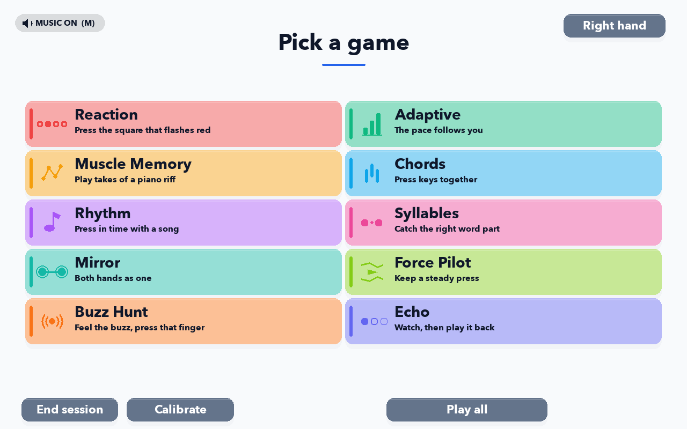
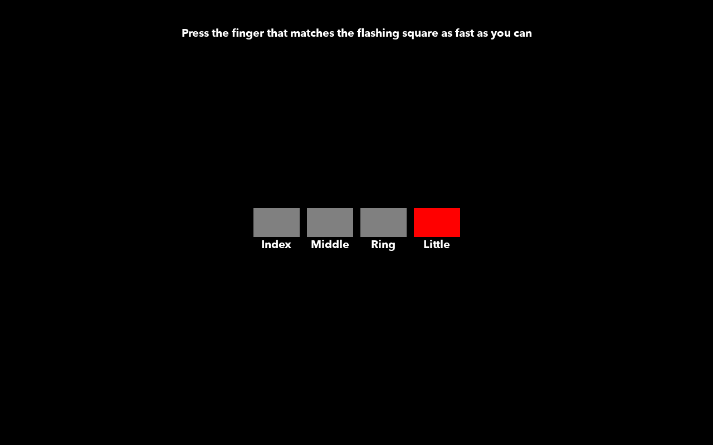
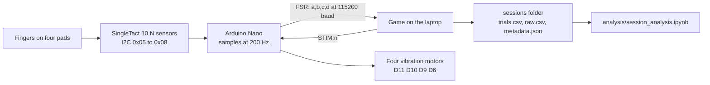

# Finger Rehab

A hand device and a laptop game for measuring and training finger movement. Four force pads and four
vibration motors sit under the fingers of each hand, wired to an Arduino Nano that streams force to the
laptop over USB. Ten games run on that signal, and every press is logged with its timing and its force.




## Where things are

```
Local_Runner.command   start the EEG build on this Mac (double-click)
analysis/              the notebook: this is where results get analysed
sessions/              recorded sessions, one folder per game
Installers/            what people install: Windows exe, macOS dmg
EEG_Lab/               copy this whole folder to the lab PC
app/                   the code, config, assets, tests, build scripts
archive/               old material kept for reference, nothing live
```

## How it works



A press is found in the force stream, not by a switch: each pad keeps a slow baseline, and a press crosses the
gap between that person's resting level and their light press, measured once per hand at login. A failed read
is sent as 0, so a dead pad and a loose plug look the same. At boot the board buzzes all four motors, about 1.6 s.

## Install

Two installers come out of the build-apps run on GitHub (Actions tab, latest run):

- **Windows:** run `FingerRehab-Setup-Windows.exe`. It installs under `%LOCALAPPDATA%\Programs\Finger Rehab`,
  no administrator needed, and turns auto-start on. SmartScreen says "Windows protected your PC" the first
  time: More info, then Run anyway. Uninstalling keeps the sessions folder.
- **macOS:** open `FingerRehab-macOS.dmg` and drag Finger Rehab into Applications. The first open is refused
  because the app is not notarised: System Settings, Privacy & Security, Open Anyway. Once is enough.

Local builds: `app\builds\build_app.bat` (Windows), `app/builds/build_app.sh` (macOS). From source: `pip install -r
requirements.txt`, then `python app/main.py`; tests are `cd app && python -m pytest tests`. Nothing plugged in? The keyboard
stands in: `J K L ;` right hand, `F D S A` left, index to little. Force Pilot and Buzz Hunt need the device.

## When a board is plugged in

The game opens within a second. A watcher starts at login (a scheduled task on Windows, a LaunchAgent on macOS)
and checks the ports once a second. It acts only on a board arriving: a board already in at login needs an unplug
and replug, and closing the game leaves it closed. A second copy is refused with "Finger Rehab is already
running". On macOS auto-start turns itself on at the first launch from Applications, not from the disk image.

## The ten games

| Game | What the patient does, and what it measures |
| --- | --- |
| **Reaction** | Press the finger that lights up. Measures how fast the hand answers the eye. |
| **Adaptive** | The same, with the pace following the player. Measures speed at a held difficulty. |
| **Muscle Memory** | Play a piano riff, take after take. Measures learning of a repeated sequence. |
| **Chords** | Press two to four fingers at once. Measures moving fingers together and holding the rest still. |
| **Rhythm** | Press on the beat of a song. Measures timing error against the beat. |
| **Syllables** | Catch the right part of a spoken word. Measures reading by sound. |
| **Mirror** | Press the same finger on both hands at once. Measures how well the hands stay together. |
| **Force Pilot** | Hold a press inside a moving corridor. Measures steady control of force. |
| **Buzz Hunt** | Feel which finger buzzed, then press it. Measures the sense of touch. |
| **Echo** | Watch a sequence light up, then repeat it back. Measures memory span. |

## Settings

The cog at the bottom right of the login screen: live finger readout, port dropdowns, Test STIM per hand,
Open data folder, and one column of three repairs (details in [app/docs/flashing.txt](app/docs/flashing.txt)).

- **Auto-start:** the switch reads on or off. Off stays off; the next launch does not turn it back on.
- **Flash firmware:** writes the game firmware to the board with the bundled avrdude, about ten seconds.
- **Sensor address:** moves one SingleTact to a new I2C address, with only that sensor connected.

## Troubleshooting

**A sensor reads nothing, or sits at zero.** Its tile in Settings never moves while the others do. A failed
I2C read is sent as 0, so a loose lead, a dead pad and a pad on the wrong address all look the same. Reseat
both ends of the lead, then Settings, Sensor address, Scan lists which addresses answer. Calibration refuses a
pad that reads zero on an empty device.

**A sensor drifts, or reads high at rest.** The finger triggers on its own, or calibration says the trigger
sits across most of that finger's travel. Thresholds come from the gap between resting and pressing, so a pad
squashed by the strap eats the gap, and under 20 counts of travel is refused. The baseline absorbs slow drift
over about ten seconds, not a preload. Reposition the pad flat and calibrate again.

**The board is not found, or the port keeps changing.** Ports are picked by USB vendor id, then any port with
a vendor id, ignoring the Mac virtual ports. First board found is the right hand, second the left, and the
login screen prints what each hand got. To pin one: Settings, Refresh, pick the port per hand, Save, which
writes `app/config/user_settings.yaml`. A saved port that no longer exists is ignored and that hand falls back to
plug order, which the login screen says.

**Calibration is asked for every time.** Once per hand per session is the design. Repeats inside one session
mean the profile was refused: under 20 counts between resting and pressing, a trigger too high in that
finger's travel, or a pad reading zero when empty. It saves to `app/config/calibration/current_<hand>.json`; if
that file never appears, the app cannot write beside itself and is using `~/Finger Rehab Data`.

**A buzzer does not buzz.** Settings, Test LEFT STIM or Test RIGHT STIM fires that hand's four motors in
order. If none fire on a board that streams data fine, it is the wiring or the motor driver, not the software.
If the test works but the buzz before a cue is missing, that cue is switched off in Sensory Cues.

**Presses register on the wrong finger.** Two pads are answering the same I2C address. Every SingleTact
answers 0x04 as well as its own address, so a write to 0x04 hits every sensor at once. Fix it in Settings,
Sensor address, with only that sensor connected: 0x05 index, 0x06 middle, 0x07 ring, 0x08 pinky. Never move a
sensor off 0x04 with the others wired in. Two whole hands swapped is the port assignment above.

**The game does not open when I plug the board in.** Open Settings and press Refresh. Not listed means a lead
or a driver, not the auto-start. Listed means the Auto-start switch should read on; press it if it reads off.
It only fires when a board arrives, so if it was already in at login, unplug and replug.

**The board needs re-flashing.** Settings, Flash firmware writes `app/assets/firmware/finger_rehab_nano.hex` with
the bundled avrdude, so no developer tools are needed. A Nano runs one of two bootloaders, 115200 or 57600;
the app tries one, then the other, and remembers which worked.

**The game runs but no data lands.** Settings, Open data folder opens the folder actually in use, which is
`~/Finger Rehab Data` when the app cannot write beside itself. Also check Test Mode is off in Settings
(`game.test_mode_enabled`), because it caps every block at six trials.

**The EEG box does not appear.** Markers are off in the shipped game. The lab preset `app/config/eeg_lab.yaml` turns
them on: the lab folder's exe loads it from beside itself; from source pass `--config config/eeg_lab.yaml`. Set
`eeg.port` to the box's port. With `eeg.require_port` true the session refuses to start without an openable box;
false falls back to a logging-only dummy. `eeg.baud` 1200 resets the MMBT-S off the bus, so the writer refuses it.

**Sessions look empty in the notebook.** It walks for `trials.csv` from the first `sessions` folder beside it
or up to four levels above, so a notebook copied elsewhere finds nothing until `SESSIONS_DIR` is set in the
setup cell. A folder holding only a header row is a block quit before the first trial closed.

## Data

Sessions land beside the app under `sessions/<date>/<person>_<time>_<mode>/`, or in `~/Finger Rehab Data`
when that folder cannot be written; Open data folder in Settings opens whichever is in use. `trials.csv` is
one row per trial: timing, hand, lane, outcome, the keys pressed, peak force and force-time integral.
`raw.csv` is every sample at 200 Hz plus event rows for presses, cues and EEG markers on the same clock.
`metadata.json` holds the block summary, the calibration and the software version; `report.html` is the
readable version. Nothing is overwritten. Open `analysis/session_analysis.ipynb`, run the Setup cell, pick a
save, then Run All. Figures land in the session folder they describe, per-person summaries in
`sessions/individual_patient_results/<person>/`, cohort output in `sessions/cohort_results/`.

## The lab folder

`EEG_Lab` (the `FingerRehab-EEGLab.zip` from the same build) holds the exe, `eeg_lab.yaml`,
`run_in_psychopy.py`, `README.txt` and a `source/` copy. The exe loads the yaml beside it and writes every
marker to the trigger box; the home install carries no EEG anything. Open `run_in_psychopy.py` in PsychoPy
Coder and press Run. Checklist and code table: [app/docs/eeg_lab_setup.txt](app/docs/eeg_lab_setup.txt).

## Licence

Thesis work by Basil Toufexis, Curtin University, 2026. No licence file yet, so ask before reusing the code.
It builds on Satoru Nakayama's 2025 thesis software, whose serial protocol and press detection are kept so
the old patient data still loads. Third-party terms live with the files: [music](app/assets/music/ATTRIBUTION.md),
[icons](app/assets/icons/LICENSE), [words](app/assets/words/LICENCE.txt) and [avrdude](app/tools/avrdude).
