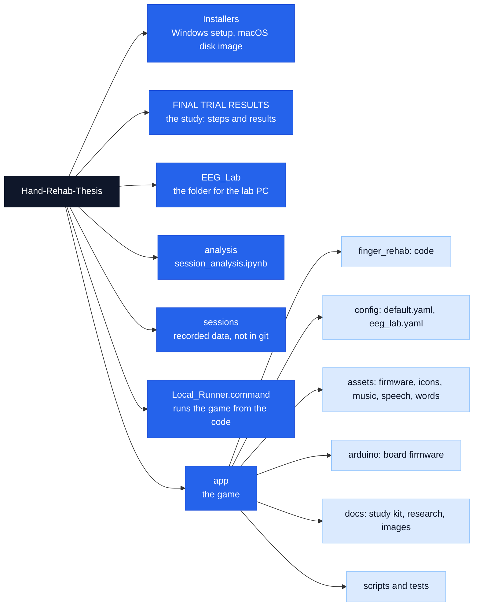
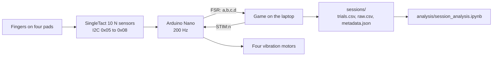

<h1 align="center">Finger Rehab</h1>

A hand device and a laptop game that measure and train finger movement. Four force pads, four vibration motors, an Arduino Nano, ten games, every press logged with its time and force.

    

<a href="#install">Install</a> &middot; <a href="#the-ten-games">Games</a> &middot; <a href="#troubleshooting">Troubleshooting</a> &middot; <a href="#data">Data</a> &middot; <a href="#the-lab-folder">Lab folder</a> &middot; <a href="CONTRIBUTING.md">Working on the code</a>

## Where things are

```mermaid
flowchart LR
  R["Hand-Rehab-Thesis"]:::root
  R --> I["Installers<br>Windows setup, macOS disk image"]:::top
  R --> Y["FINAL TRIAL RESULTS<br>the study: steps and results"]:::top
  R --> E["EEG_Lab<br>the folder for the lab PC"]:::top
  R --> N["analysis<br>session_analysis.ipynb"]:::top
  R --> S["sessions<br>recorded data, not in git"]:::top
  R --> L["Local_Runner.command<br>runs the game from the code"]:::top
  R --> A["app<br>the game"]:::top
  A --> A1["finger_rehab: code"]:::sub
  A --> A2["config: default.yaml, eeg_lab.yaml"]:::sub
  A --> A3["assets: firmware, icons, music, speech, words"]:::sub
  A --> A4["arduino: board firmware"]:::sub
  A --> A5["docs: study kit, research, images"]:::sub
  A --> A6["scripts and tests"]:::sub
  classDef root fill:#0f172a,color:#fff,stroke:#0f172a
  classDef top fill:#2563eb,color:#fff,stroke:#1d4ed8
  classDef sub fill:#dbeafe,color:#0f172a,stroke:#93c5fd
```

| Folder | What is in it |
| --- | --- |
| [`Installers/`](Installers) | What people install |
| [`FINAL TRIAL RESULTS/`](FINAL%20TRIAL%20RESULTS) | The study: what to do, and where each result goes |
| [`EEG_Lab/`](EEG_Lab) | Copy this whole folder to the lab PC |
| [`analysis/`](analysis) | The notebook that turns sessions into results |
| [`app/`](app) | Code, config, assets, tests, build scripts |
| [`archive/`](archive) | Old material, nothing live |

## How it works

 The device. Parts are numbered in <a href="app/arduino">app/arduino</a>.

```mermaid
flowchart LR
  H["Fingers on four pads"] --> S["SingleTact 10 N sensors<br>I2C 0x05 to 0x08"]
  S --> A["Arduino Nano<br>200 Hz"]
  A -->|"FSR: a,b,c,d"| G["Game on the laptop"]
  G -->|"STIM:n"| A
  A --> M["Four vibration motors"]
  G --> F["sessions/<br>trials.csv, raw.csv, metadata.json"]
  F --> N["analysis/session_analysis.ipynb"]
```

A press is a crossing of the force stream, not a switch: each pad keeps a slow baseline, and the trigger sits in the gap between that person's resting level and their light press, measured at login.

   Log in with free play or a timed session (15 to 60 minutes, games in order), pick the hand, calibrate.

## Install

- **Windows:** run [`FingerRehab-Setup-Windows.exe`](https://github.com/basil2fxs/Hand-Rehab-Thesis/releases/latest/download/FingerRehab-Setup-Windows.exe). No administrator needed. SmartScreen says "Windows protected your PC": More info, Run anyway.
- **macOS:** open [`FingerRehab-macOS.dmg`](https://github.com/basil2fxs/Hand-Rehab-Thesis/releases/latest/download/FingerRehab-macOS.dmg), drag Finger Rehab to Applications. First open: System Settings, Privacy & Security, Open Anyway.

Both are on the [latest release](https://github.com/basil2fxs/Hand-Rehab-Thesis/releases/latest), built and tested from the same commit. From source: `pip install -r app/requirements.txt`, then `python app/main.py`. No board? The keyboard stands in: `J K L ;` right hand, `F D S A` left.

## When a board is plugged in

The game opens within a second: a watcher installed at first launch checks the ports once a second. A board already in at login needs an unplug and replug.

## The ten games

<table>
<tr>
<td align="center" width="33%"> <b>Reaction</b></td>
<td align="center" width="33%"> <b>Adaptive</b></td>
<td align="center" width="33%"> <b>Muscle Memory</b></td>
</tr>
<tr>
<td align="center" width="33%"> <b>Chords</b></td>
<td align="center" width="33%"> <b>Rhythm</b></td>
<td align="center" width="33%"> <b>Syllables</b></td>
</tr>
<tr>
<td align="center" width="33%"> <b>Mirror</b></td>
<td align="center" width="33%"> <b>Force Pilot</b></td>
<td align="center" width="33%"> <b>Buzz Hunt</b></td>
</tr>
<tr>
<td align="center" width="33%"> <b>Echo</b></td>
<td align="center" width="33%"> <b>Results</b>, after every game</td>
<td align="center" width="33%"></td>
</tr>
</table>

| Game | What the player does, and what it measures |
| --- | --- |
| **Reaction** | The lab's sequence task: press the finger whose card lights up. Sequence learning. |
| **Adaptive** | Press the finger whose lane lights up, at a pace that follows the player. Speed at a held difficulty. |
| **Muscle Memory** | Play a piano riff, take after take. Learning of a repeated sequence. |
| **Chords** | Press two to four fingers at once. Moving fingers together, holding the rest still. |
| **Rhythm** | Press on the beat of a song. Timing error against the beat. |
| **Syllables** | Catch the right part of a spoken word. Reading by sound. |
| **Mirror** | Press the same finger on both hands at once. How well the hands stay together. |
| **Force Pilot** | Hold a press inside a moving corridor. Steady control of force. |
| **Buzz Hunt** | Feel which finger buzzed, then press it. The sense of touch. |
| **Echo** | Watch a sequence light up, then repeat it back. Memory span. |

## Settings

The cog on the login screen: live finger readout, port dropdowns, Test STIM per hand, Open data folder, and three repairs ([app/docs/flashing.txt](app/docs/flashing.txt)).

- **Auto-start:** the switch reads on or off. Off stays off.
- **Flash firmware:** writes the game firmware to the board with the bundled avrdude, about ten seconds.
- **Sensor address:** moves one SingleTact to a new I2C address, with only that sensor connected.

## Troubleshooting

**A sensor reads nothing, or sits at zero.** A failed read is sent as 0, so a loose lead, a dead pad and a pad on the wrong address look the same. Reseat both ends of the lead, then Settings, Sensor address, Scan shows which addresses answer.

**A sensor drifts, or reads high at rest.** A pad squashed by the strap eats the gap between resting and pressing, and under 20 counts of travel is refused. Reposition the pad flat and calibrate again.

**The board is not found, or the port keeps changing.** First board found is the right hand, second the left. To pin one: Settings, Refresh, pick the port per hand, Save. A saved port that no longer exists falls back to plug order.

**Calibration is asked for every time.** Once per hand per session is the design. A repeat inside one session means the profile was refused: under 20 counts of travel, a trigger too high, or a pad reading zero when empty.

**A buzzer does not buzz.** Settings, Test LEFT STIM or Test RIGHT STIM fires that hand's motors in order. None firing on a board that streams fine is wiring, not software. A missing buzz before a cue is a cue switched off in Sensory Cues.

**Presses register on the wrong finger.** Two pads answer the same I2C address. Settings, Sensor address, with only that sensor connected: 0x05 index, 0x06 middle, 0x07 ring, 0x08 pinky. Never move a sensor off 0x04 with the others wired in.

**The game does not open when I plug the board in.** Settings, Refresh. Not listed is a lead or a driver. Listed means the Auto-start switch should read on. It fires only when a board arrives, so unplug and replug.

**The board needs re-flashing.** Settings, Flash firmware writes `app/assets/firmware/finger_rehab_nano.hex` with the bundled avrdude. A Nano runs one of two bootloaders; the app tries both and remembers which worked.

**The game runs but no data lands.** Settings, Open data folder opens the folder in use, which is `~/Finger Rehab Data` when the app cannot write beside itself. Check Test Mode is off (`game.test_mode_enabled`): it caps every block at six trials.

**The EEG box does not appear.** Markers are off in the shipped game; `app/config/eeg_lab.yaml` turns them on, loaded from beside the lab exe or with `--config config/eeg_lab.yaml` from source. Set `eeg.port` to the box's port. `eeg.require_port` true refuses to start without a box; false logs the markers only. `eeg.baud` 1200 resets the box off the bus, so the writer refuses it.

**Sessions look empty in the notebook.** It walks for `trials.csv` from the first `sessions` folder beside it or up to four levels above; a notebook copied elsewhere needs `SESSIONS_DIR` set in the Setup cell.

## Data

Sessions land in `sessions/<date>/<name>_<time>_<game>/`: `trials.csv` one row per trial, `raw.csv` every sample at 200 Hz with the presses, cues and markers on the same clock, `metadata.json` the block summary, calibration and software version. Nothing is overwritten. Open [`analysis/session_analysis.ipynb`](analysis), run the Setup cell, pick a save, Run All.

## The lab folder

`EEG_Lab` (the `FingerRehab-EEGLab.zip` of the same build) holds the exe, `eeg_lab.yaml`, `run_in_psychopy.py`, `README.md`, a `source/` copy and `sessions/`, where `sessions/eeg/` takes ActiView's recording under the name the game menu shows.
Open `run_in_psychopy.py` in PsychoPy Coder and press Run. The home install carries no EEG anything.
`python3 app/scripts/check_lab_sync.py` says whether the lab folder is the same game as the app; `--fix` makes it so, and `Local_Runner.command` does that on every start.
Checklist and code table: [app/docs/eeg_lab_setup.txt](app/docs/eeg_lab_setup.txt).

## Licence

Thesis work by Basil Toufexis, Curtin University, 2026; ask before reusing the code. It builds on Satoru Nakayama's 2025 software, whose serial protocol and press detection are kept so the old patient data still loads. Third-party terms live with the files: [music](app/assets/music/ATTRIBUTION.md), [icons](app/assets/icons/LICENSE), [words](app/assets/words/LICENCE.txt), [avrdude](app/tools/avrdude).
