<p align="center">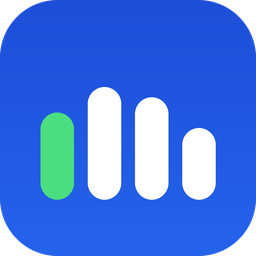</p>
<h1 align="center">Finger Rehab</h1>
<p align="center">A hand device and a game for Windows and macOS that measure and train finger movement.<br>Four force pads, four vibration motors and an Arduino Nano. Ten games. Every press is logged with its time and force.</p>
<p align="center"><a href="https://github.com/basil2fxs/Hand-Rehab-Thesis/releases/latest"></a> <a href="https://github.com/basil2fxs/Hand-Rehab-Thesis/actions/workflows/build-apps.yml"></a></p>
<p align="center"><a href="#install">Install</a> &middot; <a href="#the-ten-games">Games</a> &middot; <a href="#troubleshooting">Troubleshooting</a> &middot; <a href="#data">Data</a> &middot; <a href="#the-lab-folder">Lab folder</a> &middot; <a href="CONTRIBUTING.md">Working on the code</a></p>
<p align="center">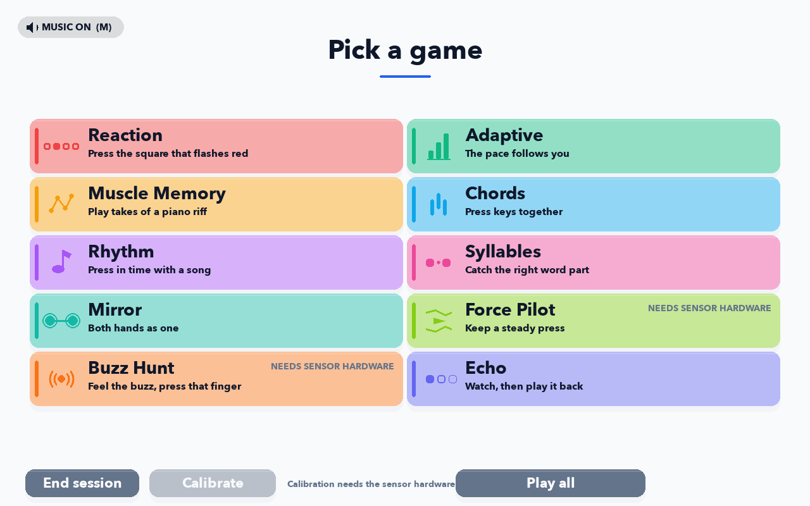</p>

## Where things are

```text
Hand-Rehab-Thesis/
|
|-- Installers/               The Windows and macOS installers, from the latest release
|
|-- EEG_Lab/                  The folder that goes on the EEG lab computer
|   `-- developer/            Stays off the lab PC: the EEG simulator and set-up tools
|
|-- FINAL TRIAL RESULTS/      The study: what to run, and where each result goes
|
|-- analysis/                 The notebook that turns recorded sessions into results
|
|-- app/                      The game
|   |-- main.py               Starts it
|   |-- finger_rehab/         The code: games, screens, boards, data logging
|   |-- config/               Settings files (eeg_lab.yaml turns on the lab's markers)
|   |-- assets/               Board firmware, icons, music, speech and word lists
|   |-- arduino/              Source code of the board firmware
|   |-- docs/                 Study-day forms, research notes, screenshots
|   |-- scripts/              Tools run by hand: device checks, simulations, lab sync
|   |-- tests/                Automated tests
|   `-- builds/               Scripts that build the installers
|
|-- hardware/                 Build the device: parts, wiring, pins, CAD and print files
|-- archive/                  Old material. Nothing here runs
|-- sessions/                 Recorded data (kept off GitHub)
`-- Local_Runner.command      Runs the game straight from the code on a Mac
```

## How it works

<p align="center">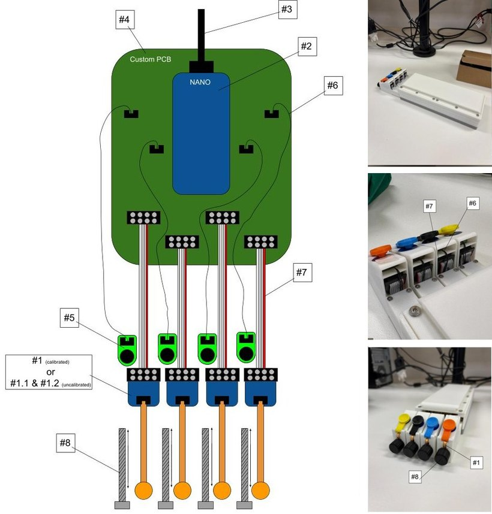<br><sub>The device. Parts are numbered in <a href="app/arduino">app/arduino</a>.</sub></p>

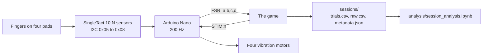
```mermaid
flowchart LR
  H["Fingers on four pads"] --> S["SingleTact 10 N sensors<br>I2C 0x05 to 0x08"]
  S --> A["Arduino Nano<br>200 Hz"]
  A -->|"FSR: a,b,c,d"| G["The game"]
  G -->|"STIM:n"| A
  A --> M["Four vibration motors"]
  G --> F["sessions/<br>trials.csv, raw.csv, metadata.json"]
  F --> N["analysis/session_analysis.ipynb"]
```

There's no switch under a finger. Each pad keeps a slow baseline, and a press counts when the force crosses a trigger 30% of the way from that person's resting level to their light press, both measured at login.

<p align="center">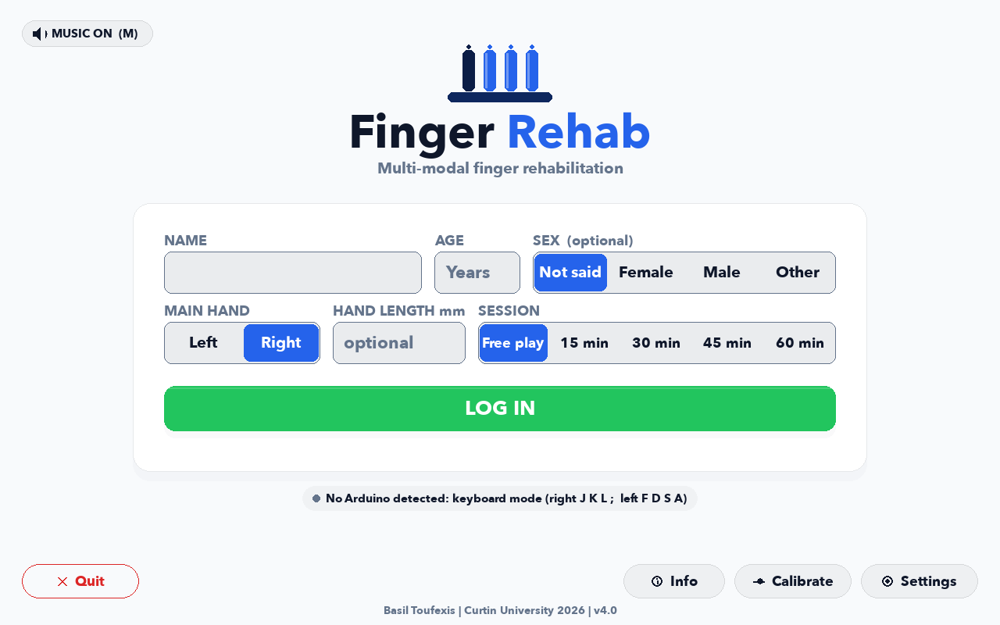 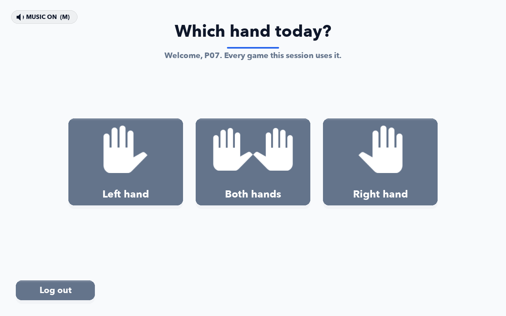 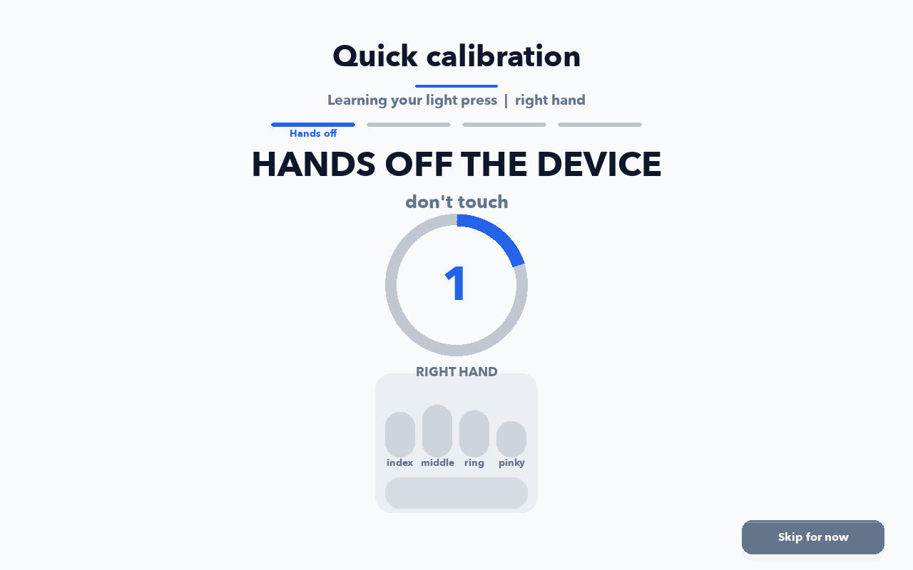<br><sub>Log in (free play, or a timed session of 15 to 60 minutes), pick the hand, calibrate. The game menu has the same session picker.</sub></p>

## Timing and limits

- **Pads:** each SingleTact reads 0 to 10 N in 512 steps, about 20 mN a step. The manual quotes up to 120 Hz, but in recorded sessions the pads gave a new value on nearly every 5 ms read: while force changed quickly, under 3% of samples repeated. Slower changes repeat because they are smaller than one step.
- **Board:** the Nano reads all four pads every 5 ms (199 Hz measured) and sends one line over USB at 115200 baud. A failed read arrives as 0.
- **USB:** samples reach the computer in bursts, about four every 20 ms, and are timed when they arrive: about 10 ms after the pad was read on average, up to about 20 ms. The analysis notebook can re-time presses on the board's own 5 ms clock.
- **Presses:** a press counts when the smoothed force crosses the trigger, 7 to 11 ms after the raw crossing.
- **Screen:** the game draws 60 frames a second, so a cue shows on the next frame, up to 17 ms later.
- **Sound and buzz:** on the study computer a sound was heard 77 to 87 ms after the game played it and a motor moved 74 ms after its command. Every computer needs its own measurement: Settings, Setup, Audio delay.
- **EEG markers:** a stimulus byte goes out on the frame that draws the stimulus; the monitor's and the speaker's own delays come on top and are timed once per lab PC with a light sensor and a microphone. A press byte leaves up to one frame (17 ms) after its sample, on top of the USB delay above; `events.tsv` moves each one back to its sample on the board's clock and to where the push began, a median 50 ms before the trigger. Each byte is held until the first frame at least 8 ms later, 8 to 17 ms at 60 Hz. Confirm the lab's recording rate before the first session ([app/docs/eeg_lab_setup.txt](app/docs/eeg_lab_setup.txt)).

## Install

- **Windows:** run [`FingerRehab-Setup-Windows.exe`](https://github.com/basil2fxs/Hand-Rehab-Thesis/releases/latest/download/FingerRehab-Setup-Windows.exe). No administrator needed. SmartScreen says "Windows protected your PC": More info, Run anyway.
- **macOS:** open [`FingerRehab-macOS.dmg`](https://github.com/basil2fxs/Hand-Rehab-Thesis/releases/latest/download/FingerRehab-macOS.dmg), drag Finger Rehab to Applications. First open: System Settings, Privacy & Security, Open Anyway.

Both are on the [latest release](https://github.com/basil2fxs/Hand-Rehab-Thesis/releases/latest), built and tested from the same commit. From source: `pip install -r app/requirements.txt`, then `python app/main.py`. No board? The keyboard stands in: `J K L ;` right hand, `F D S A` left.

## When a board is plugged in

The game opens within a second. A watcher installed at first launch checks the ports once a second. If the board was already plugged in when the computer started, unplug it and plug it back in.

## The ten games

<table>
<tr>
<td align="center" width="33%">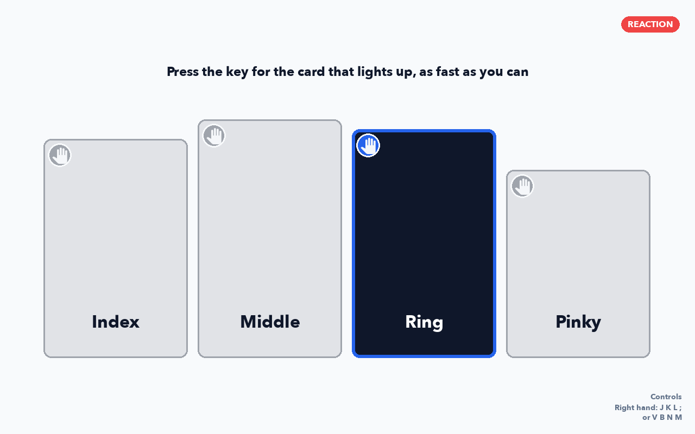<br><sub><b>Reaction</b></sub></td>
<td align="center" width="33%">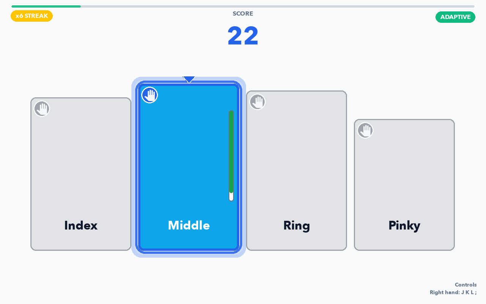<br><sub><b>Adaptive</b></sub></td>
<td align="center" width="33%">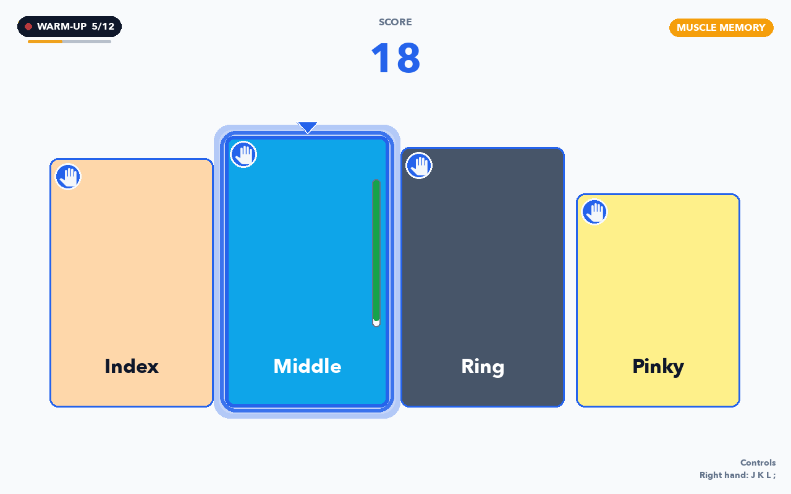<br><sub><b>Muscle Memory</b></sub></td>
</tr>
<tr>
<td align="center" width="33%">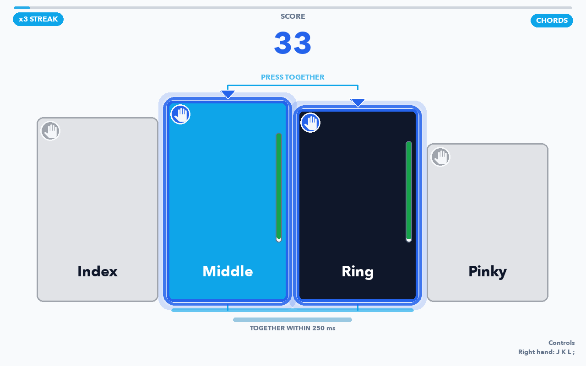<br><sub><b>Chords</b></sub></td>
<td align="center" width="33%">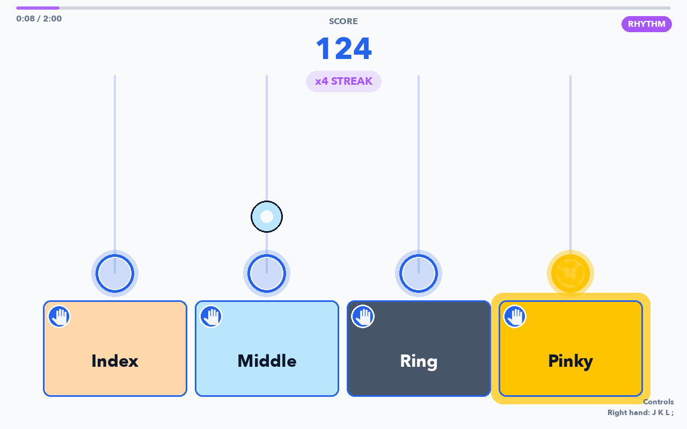<br><sub><b>Rhythm</b></sub></td>
<td align="center" width="33%">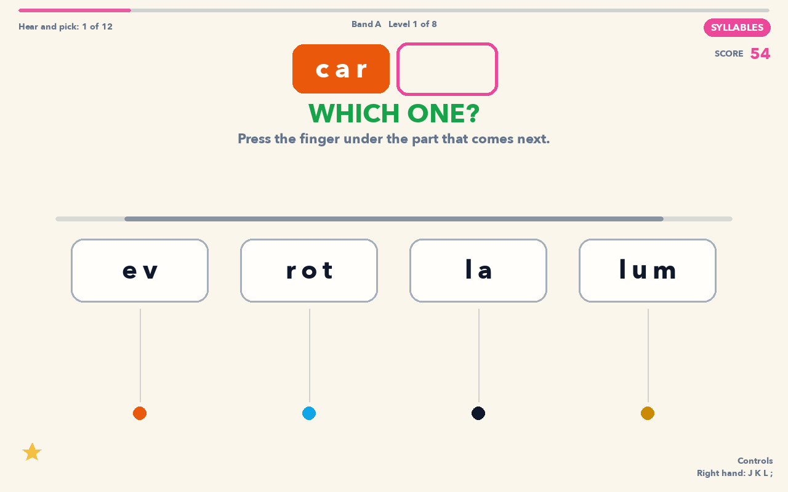<br><sub><b>Syllables</b></sub></td>
</tr>
<tr>
<td align="center" width="33%">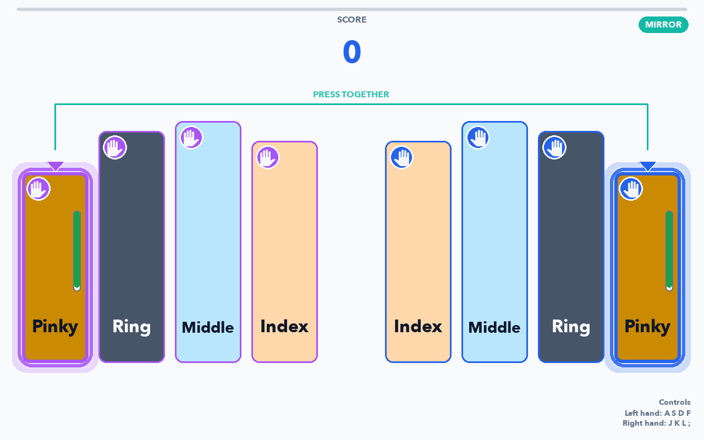<br><sub><b>Mirror</b></sub></td>
<td align="center" width="33%">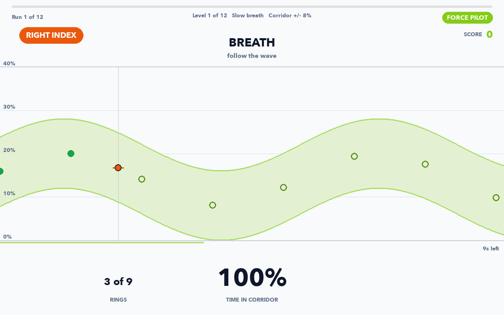<br><sub><b>Force Pilot</b></sub></td>
<td align="center" width="33%">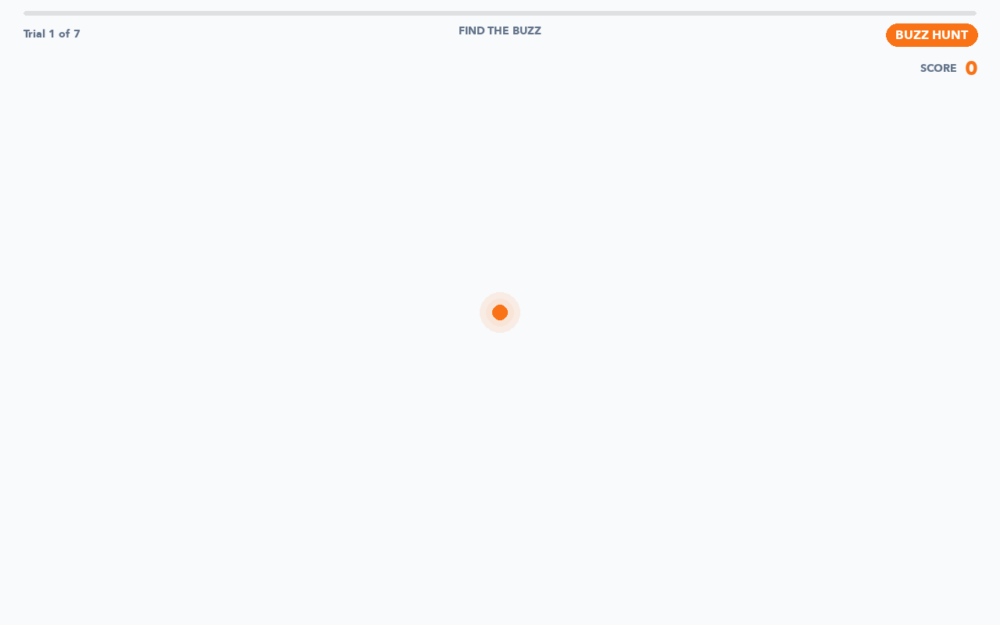<br><sub><b>Buzz Hunt</b></sub></td>
</tr>
<tr>
<td align="center" width="33%">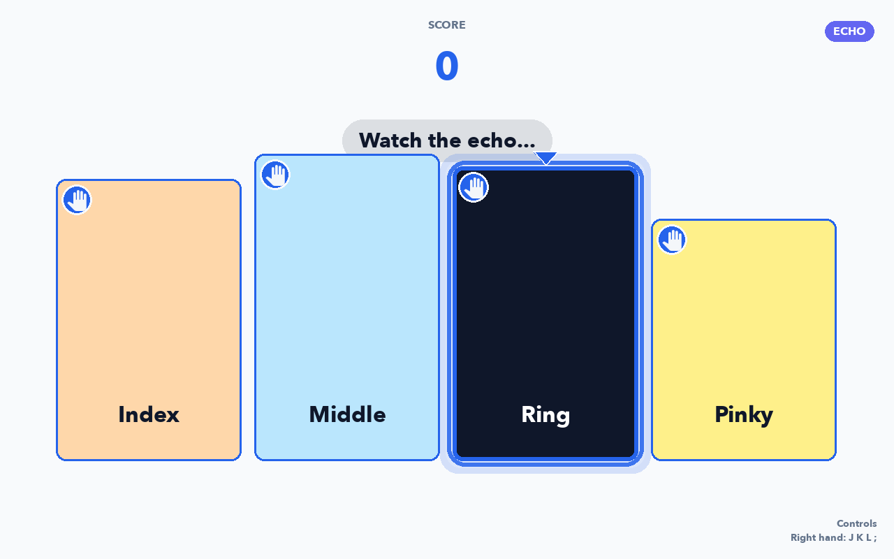<br><sub><b>Echo</b></sub></td>
<td align="center" width="33%">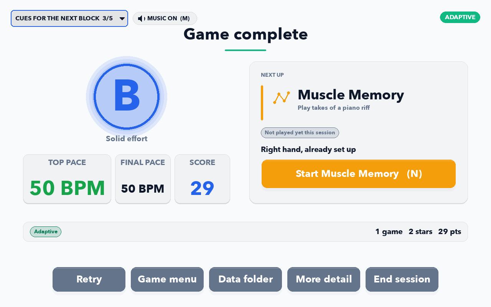<br><sub><b>Results</b>, after every game</sub></td>
<td align="center" width="33%"></td>
</tr>
</table>

| Game | What the player does, and what it measures |
| --- | --- |
| **Reaction** | The lab's sequence task: press the finger whose card lights up. Sequence learning. |
| **Adaptive** | Press the finger whose lane lights up, at a pace that follows the player. Speed at a held difficulty. |
| **Muscle Memory** | Play a piano riff, take after take. Learning of a repeated sequence. |
| **Chords** | Press two to four fingers at once. Moving fingers together, holding the rest still. |
| **Rhythm** | Press on the beat of a song. Timing error against the beat. |
| **Syllables** | Catch the right part of a spoken word. Reading by sound. |
| **Mirror** | Press the same finger on both hands at once. How well the hands stay together. |
| **Force Pilot** | Keep a press on a moving line. Steady control of force. |
| **Buzz Hunt** | Feel which finger buzzed, then press it. The sense of touch. |
| **Echo** | Watch a sequence light up, then repeat it back. Memory span. |

## Settings

<p align="center">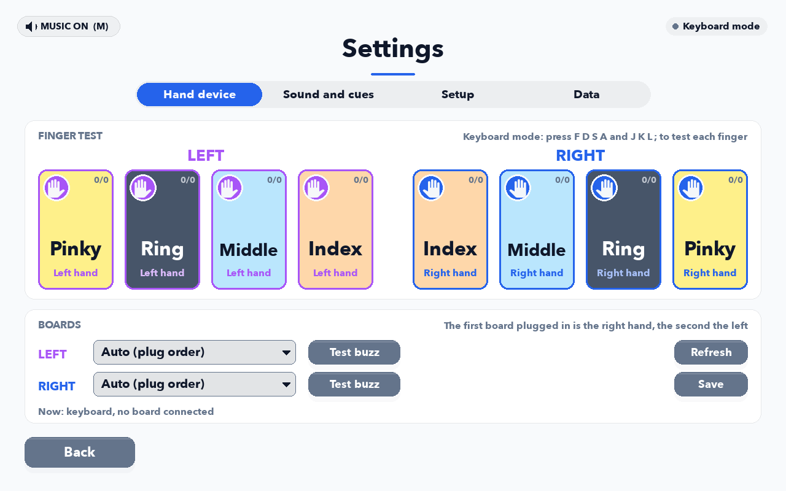</p>

The cog on the login screen. Four tabs: Hand device (the finger test, which board is which hand, a test buzz), Sound and cues (the levels and the cue switches), Setup, and Data (the data folder, the Muscle Memory riff, Test Mode). The Setup jobs ([app/docs/flashing.txt](app/docs/flashing.txt)):

- **Auto-start:** opens the game when the board is plugged in. The switch reads on or off, and off stays off.
- **Flash firmware:** writes the game firmware to the board with the avrdude bundled in the app, about ten seconds.
- **Sensor address:** moves one SingleTact to a new I2C address, with only that sensor connected.
- **Audio delay:** once on a new computer, times its sound and buzz with the microphone so Rhythm lands on the beat. About two minutes in a quiet room with the board plugged in; on Windows it asks for taps on the index pad.

On Windows there's also USB driver: if a board is plugged in but never shows up, it gets the board's driver from Windows Update.

## Troubleshooting

**A sensor reads nothing, or sits at zero.** A failed read is sent as 0, so a loose lead, a dead pad and a pad on the wrong address look the same. Reseat both ends of the lead, then Settings, Setup, Sensor address, Scan shows which addresses answer.

**A sensor drifts, or reads high at rest.** A pad squashed by the strap eats the gap between resting and pressing, and under 20 counts of travel is refused. Reposition the pad flat and calibrate again.

**The board is not found, or the port keeps changing.** The first board found is the right hand, the second the left. To pin one: Settings, Hand device, pick the port per hand, Save. A saved port that no longer exists falls back to plug order. On Windows, a board that never shows up at all usually has no driver yet: Settings, Setup, USB driver.

**Calibration is asked for every time.** Once per hand per session is the design. A repeat inside one session means the profile was refused: under 20 counts of travel, a trigger too high, or a pad reading zero when empty.

**A buzzer does not buzz.** Settings, Hand device, Test buzz fires that hand's motors in order, and clicking a finger tile buzzes just that finger. None firing on a board that streams fine is wiring, not software. No buzz before a cue means the cue is switched off in Sound and cues.

**Presses register on the wrong finger.** Two pads answer the same I2C address. Settings, Setup, Sensor address, with only that sensor connected: 0x05 index, 0x06 middle, 0x07 ring, 0x08 pinky. Never move a sensor off 0x04 with the others wired in.

**The game does not open when the board is plugged in.** Settings, Hand device, Refresh. If the board isn't listed, it's the lead or the driver (Setup, USB driver). If it is, Auto-start should read on; it only fires when a board arrives, so unplug and replug.

**The board needs re-flashing.** Settings, Setup, Flash firmware writes `app/assets/firmware/finger_rehab_nano.hex` with the bundled avrdude. A Nano runs one of two bootloaders; the app tries both and remembers which worked.

**The game runs but no data lands.** Settings, Data, Open data folder opens the folder in use, which is `~/Finger Rehab Data` when the app can't write beside itself. Check Test Mode is off (`game.test_mode_enabled`): it caps every block at six trials.

**The EEG box does not appear.** Markers are off in the shipped game; `app/config/eeg_lab.yaml` turns them on, loaded from beside the lab exe or with `--config config/eeg_lab.yaml` from source. Set `eeg.port` to the box's port. `eeg.require_port` true refuses to start without a box; false logs the markers only. `eeg.baud` stays 9600: 1200 would reset the box, so the game refuses it.

**Sessions look empty in the notebook.** It walks for `trials.csv` from the first `sessions` folder beside it or up to four levels above; a notebook copied elsewhere needs `SESSIONS_DIR` set in the Setup cell.

## Data

Sessions land in `sessions/<date>/<name>_<time>_<game>/`: `trials.csv` one row per trial, `raw.csv` every sample at 200 Hz with the presses, cues and markers on the same clock, `metadata.json` the block summary, calibration and software version. Nothing is overwritten. Open [`analysis/session_analysis.ipynb`](analysis), run the Setup cell, pick a save, Run All.

## The lab folder

`EEG_Lab` (the `FingerRehab-EEGLab.zip` of the same build) holds the exe, `eeg_lab.yaml`, `run_in_psychopy.py`, `README.md`, a `source/` copy and `sessions/`, where `sessions/eeg/` takes ActiView's recording under the name the game menu shows, copied in from the EEG PC when ActiView runs there. Its `developer/` folder stays on the development PC: an EEG simulator for rehearsing, the PsychoPy download and a new-PC check.
Open `run_in_psychopy.py` in PsychoPy Coder and press Run. The home install carries no EEG anything.
`python3 app/scripts/check_lab_sync.py` says whether the lab folder is the same game as the app; `--fix` makes it so, and `Local_Runner.command` does that on every start.
What each number means, in one picture: [EEG_Lab/README.md](EEG_Lab/README.md). Checklist and code table: [app/docs/eeg_lab_setup.txt](app/docs/eeg_lab_setup.txt).

## Licence

Thesis work by Basil Toufexis, Curtin University, 2026; ask before reusing the code. It builds on Satoru Nakayama's 2025 software, whose serial protocol and press detection are kept so the old patient data still loads. Third-party terms live with the files: [music](app/assets/music/ATTRIBUTION.md), [icons](app/assets/icons/LICENSE), [words](app/assets/words/LICENCE.txt), [avrdude](app/tools/avrdude).
