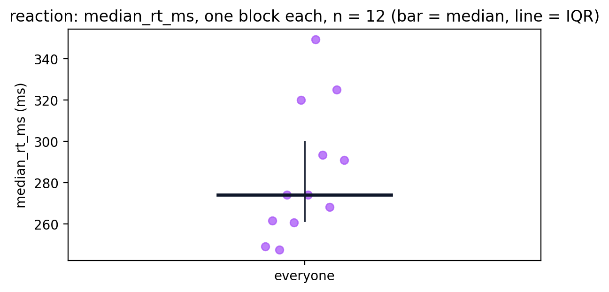
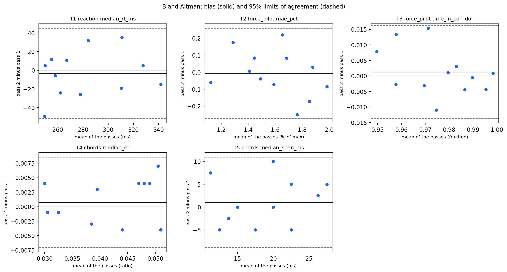

# analysis

[`session_analysis.ipynb`](session_analysis.ipynb) turns recorded sessions into results: a chapter per game, the cohort tables and figures, a report, and the reference list.

1. `pip install -r ../app/requirements.txt`
2. Open the notebook in VS Code or Jupyter and run the Setup cell.
3. Pick a save from the dropdown, then Run All.

  Two of the cohort chapter's figures, from a simulated cohort.

It finds `sessions/` beside it or up to four levels above; set `SESSIONS_DIR` in the Setup cell for a copy kept elsewhere. Figures land in the session folder they describe, per-person summaries in `sessions/individual_patient_results/<person>/`, cohort output in `sessions/cohort_results/`.
