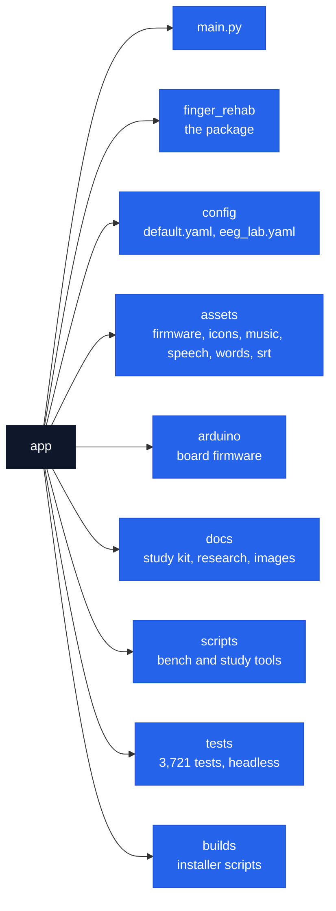

# app

The game: one program, [`main.py`](main.py), and what it ships with. Users want the [front page](../README.md); this page is for whoever changes the code, and [CONTRIBUTING.md](../CONTRIBUTING.md) is the whole loop from a fresh clone to a release.

| Folder | What is in it |
| --- | --- |
| [`finger_rehab/`](finger_rehab) | Engine, games, screens, hardware, logging |
| [`config/`](config) | Every setting, commented; the lab overlay |
| [`assets/`](assets) | Firmware, icons, music, speech, word lists, SRT tones |
| [`arduino/`](arduino) | The board's firmware and the sensor address tool |
| [`docs/`](docs) | Study-day kit, research, the lab checklist, screenshots |
| [`scripts/`](scripts) | Tools run by hand: device checks, latency, simulation |
| [`tests/`](tests) | `python -m pytest tests`, about four minutes |
| [`builds/`](builds) | `build_app.sh`, `build_app.bat`, firmware and avrdude fetch |

Run from source: `pip install -r requirements.txt`, then `python main.py`. The lab overlay: `python main.py --config config/eeg_lab.yaml`.
