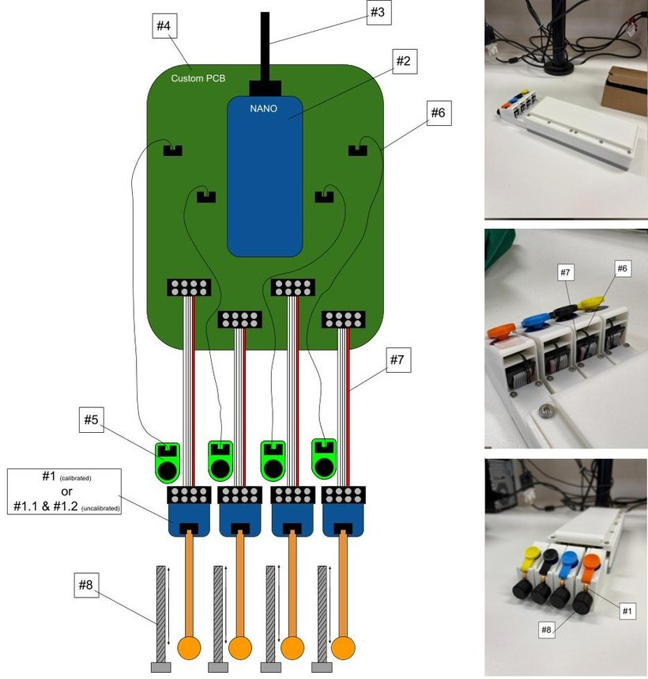

# arduino

<b>1</b> SingleTact pad and its board &middot; <b>2</b> Arduino Nano &middot; <b>3</b> USB cable &middot; <b>4</b> custom PCB &middot; <b>5</b> motor PCB <b>6</b> motor PCB connector &middot; <b>7</b> force sensor connector &middot; <b>8</b> threaded screw for finger adjustment Drawing, photos and parts list: <a href="../../archive/old_rayyan_stuff">archive/old_rayyan_stuff</a>

| Folder | What it is |
| --- | --- |
| [`firmware_on_device/`](firmware_on_device) | The game firmware for the Arduino Nano: reads the four pads at 200 Hz and drives the four motors |
| [`singletact_address_change/`](singletact_address_change) | A short-lived sketch that moves one sensor to a new I2C address |

Nobody needs the Arduino IDE. The built hexes ship in [`../assets/firmware`](../assets/firmware), and Settings
flashes them (Flash firmware, Sensor address). `python builds/build_firmware.py` rebuilds both with PlatformIO,
and the build-apps run on GitHub does the same.

[Back to app](../README.md)
