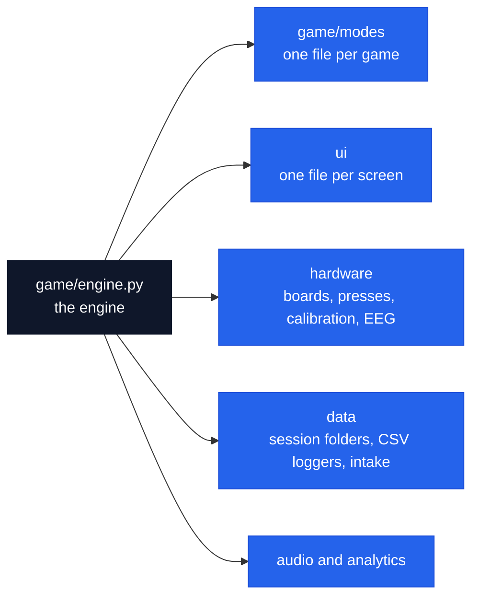

# finger_rehab

The game as a Python package. `main.py` builds a `GameEngine`, gives it an input source (the boards or the keyboard) and runs its frame loop; everything hangs off the engine.

| Package | What it does |
| --- | --- |
| [`game/`](game) | The engine, Play all ([`battery.py`](game/battery.py)), scoring, scheduling |
| [`game/modes/`](game/modes) | One file per game; each file's docstring is that game's research case |
| [`ui/`](ui) | Every screen |
| [`hardware/`](hardware) | Serial boards, press detection, calibration, EEG markers, auto-start, flashing |
| [`data/`](data) | Session folders, the CSV loggers, intake and history |
| [`audio/`](audio) | Cues, music, the rhythm scheduler |
| [`analytics/`](analytics) | The adaptive controller and the in-game metrics |

   A session: log in, pick a game, read the results.

