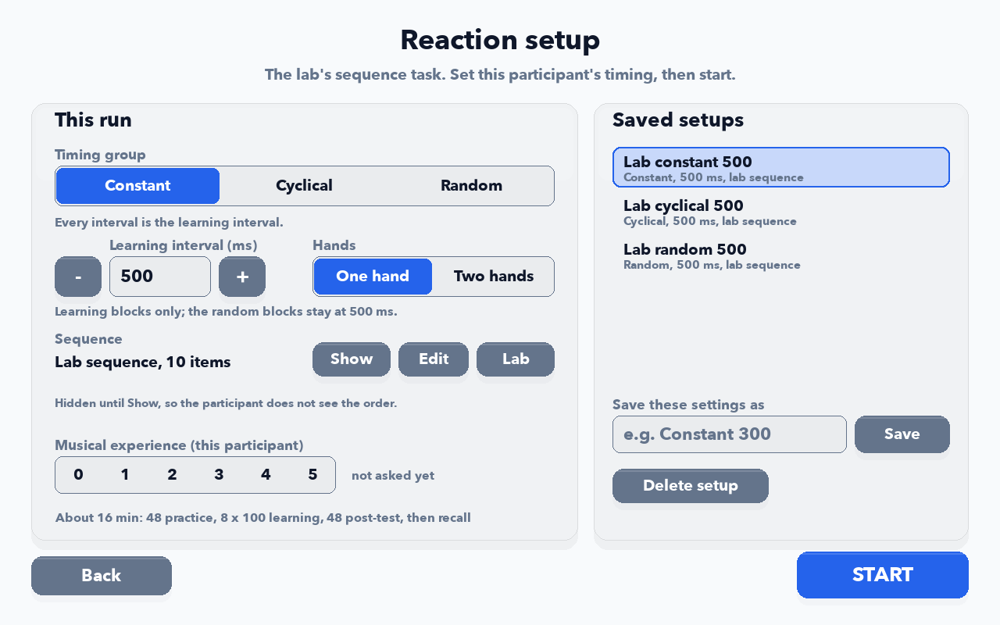
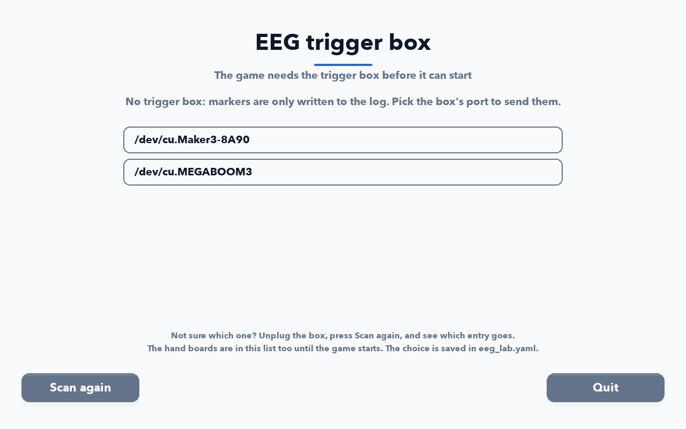

# ui

One file per screen. [`screens.py`](screens.py) holds the login, the hub, the lane games, the results and Settings; the rest are one screen each. [`theme.py`](theme.py) is the palette, [`widgets.py`](widgets.py) the buttons and lane strips.

<table>
<tr>
<td align="center" width="33%"> <b>Login</b> <code>screens.py</code> TitleScreen</td>
<td align="center" width="33%"> <b>Hand</b> <code>hand_choice_screen.py</code></td>
<td align="center" width="33%"> <b>Quick calibration</b> <code>quick_calibration_screen.py</code></td>
</tr>
<tr>
<td align="center" width="33%"> <b>Hub</b> <code>screens.py</code> ModeSelectScreen</td>
<td align="center" width="33%"> <b>Lane games</b> <code>screens.py</code> GameplayScreen</td>
<td align="center" width="33%"> <b>Rhythm</b> <code>screens.py</code> RhythmScreen</td>
</tr>
<tr>
<td align="center" width="33%"> <b>Syllables</b> <code>syllables_screen.py</code></td>
<td align="center" width="33%"> <b>Force Pilot</b> <code>force_pilot_screen.py</code></td>
<td align="center" width="33%"> <b>Buzz Hunt</b> <code>buzz_hunt_screen.py</code></td>
</tr>
<tr>
<td align="center" width="33%"> <b>Reaction</b> <code>srt_screen.py</code></td>
<td align="center" width="33%"> <b>Reaction setup</b> <code>srt_setup_screen.py</code></td>
<td align="center" width="33%"> <b>Results</b> <code>screens.py</code> ResultsScreen</td>
</tr>
<tr>
<td align="center" width="33%"> <b>Settings</b> <code>screens.py</code> DiagnosticsScreen</td>
<td align="center" width="33%"> <b>EEG trigger box</b> <code>eeg_port_screen.py</code></td>
<td align="center" width="33%"></td>
</tr>
</table>

Every picture here is rendered by `python3 scripts/make_screenshots.py` from the real screens, headless.
