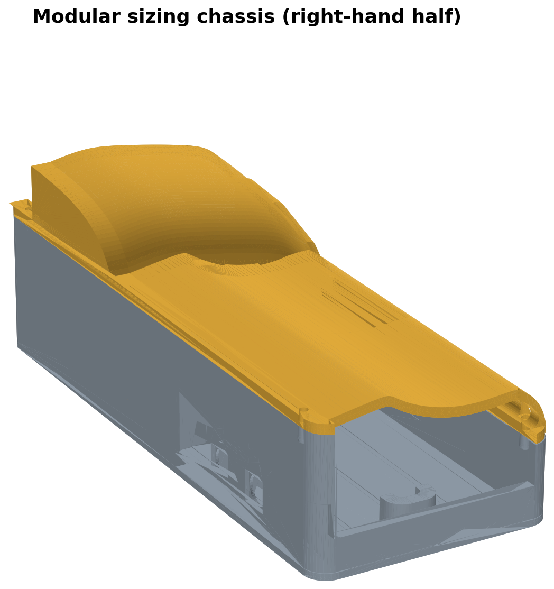
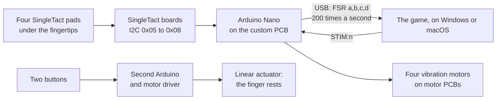

<h1 align="center">Hardware</h1>

The hand device: a printed chassis, four force pads, four vibration motors and an Arduino Nano. Everything needed to build one, and how it talks to the game.

 

## In this folder

| Path | What it is |
| --- | --- |
| [`cad/hand_device_v1.f3d`](cad/hand_device_v1.f3d) | The Fusion 360 model, Design v1.0. The part sizes and the mirrored left half come from it |
| [`cad/base.stl`](cad/base.stl), [`cad/top.stl`](cad/top.stl), [`cad/fingers.stl`](cad/fingers.stl) | The three printed parts, ready to slice. GitHub shows each one in 3D |
| [`linear_actuator/`](linear_actuator) | The sketch that moves the finger rests in and out |
| [`images/`](images) | The CAD render, the cross-section, both halves, and the parts and wiring diagram |

The game board's firmware is in [`app/arduino`](../app/arduino). The app flashes it from Settings, Setup, Flash firmware; the Arduino IDE is not needed.

## How it fits together

## Parts

| Part | Qty | AUD each | Notes |
| --- | --- | --- | --- |
| SingleTact 8 mm 10 N pad, calibrated, with its electronics | 4 | 192 | From the 2025 project. A failed pad costs 192 to replace |
| *or* SingleTact 8 mm 10 N pad, uncalibrated | 4 | 53 | Bought for the sensor comparison. Needs the board below; a failed pad costs 53 and its board is kept |
| SingleTact standard electronics (board and jumper wires) | 4 | 62 | Only with the uncalibrated pads |
| Arduino Nano | 2 | 15 to 48 | One reads the pads and drives the motors, one drives the actuator. Clones work |
| USB A to micro B cable | 1 | 17 | Jaycar |
| Custom PCB for the Nano | 1 | | From the 2025 project; its design files are not in this repo |
| Vibration motor on a motor PCB, with connector | 4 | | Supplied by the Curtin electronics team, 2026 |
| Force sensor connector | 4 | | One per pad |
| Threaded screw | 4 | | Fine adjustment of each finger rest |
| Linear actuator with motor driver | 1 | 45 | Two were bought, one for each hand |
| Neodymium magnet | 4 | 5 | Hold the top shell on |
| PLA and PETG filament | 2 spools | 30 | The chassis is PLA: about 370 cm3 of solid plastic, less with infill |

From Rayan's diagram ([`images/parts_and_wiring.jpg`](images/parts_and_wiring.jpg)) and the thesis cost table. A left-hand device is being built with the uncalibrated pads and the second actuator, from the mirrored left half of the model.

## Wiring

The game board, an Arduino Nano on the custom PCB:

| Nano pin | Goes to |
| --- | --- |
| A4 (SDA), A5 (SCL), 5V, GND | The four SingleTact boards, on one I2C bus |
| D11 | Index finger motor |
| D10 | Middle finger motor |
| D9 | Ring finger motor |
| D6 | Little finger motor |
| USB | The computer |

- **Pads:** index 0x05, middle 0x06, ring 0x07, little 0x08. A new pad arrives on a factory address; move it with Settings, Setup, Sensor address, with only that pad plugged in.
- **Readings:** the board reads 6 bytes from each pad 200 times a second and sends `FSR: a,b,c,d` over USB at 115200 baud. The manual quotes up to 120 Hz per pad, but recorded sessions show a new value on nearly every read; values repeat when force changes by less than one step.
- **Buzz:** `STIM:n` from the game drives motor n (1 to 4) for 150 ms at PWM 200 of 255 (240 on the little finger).

The actuator board, a second Arduino running [`linear_actuator.ino`](linear_actuator/linear_actuator.ino):

| Pin | Goes to |
| --- | --- |
| D8, D9 | Driver IN1 and IN2: the direction |
| D10 | Driver ENA: the speed, PWM 255 |
| D2 | Extend button, to GND |
| D3 | Retract button, to GND |

Hold a button to move the rests. Let go, or press both, and it stops.

## Printing and assembly

| Part | File | Size, mm |
| --- | --- | --- |
| Base | [`base.stl`](cad/base.stl) | 98 x 231 x 56 |
| Top shell | [`top.stl`](cad/top.stl) | 98 x 231 x 52 |
| Finger rests | [`fingers.stl`](cad/fingers.stl) | 78 x 130 x 53 |

- Print in PLA. The base and top are 231 mm long, so check the bed first.
- The base holds the actuator and the four pads. The top shell sits over it on the four magnets and can be swapped for other finger-groove layouts.
- The actuator moves the finger rests in and out for hand length, over the 5th to 95th percentile of the ANSUR II survey; the screws fine-tune each finger.
- Fingertips meet the pads with about 2 mm of clearance, and the forearm rests at about 30 degrees of pronation ([cross-section](images/chassis_section.png), [both halves](images/chassis_left_right.png)).
- **Safety:** the actuator can pinch. Set the finger rests before the hand goes on and never move them with a hand in place; no stall shut-off is fitted yet.

## Not part of this build

The EEG lab's marker box is the lab's own Arduino on COM10: it puts each byte the game sends onto the EEG trigger lines. See [`EEG_Lab`](../EEG_Lab).

More: the sensor address walkthrough and Rayan's bench analysis are in [`archive/old_rayyan_stuff`](../archive/old_rayyan_stuff); the SingleTact user manual (singletact.com) shows the pad wiring.
